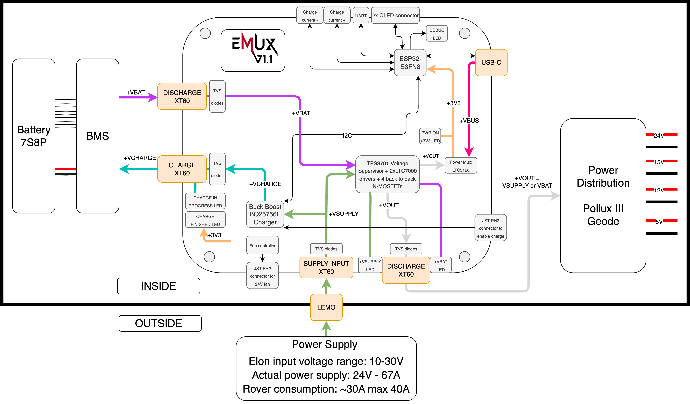
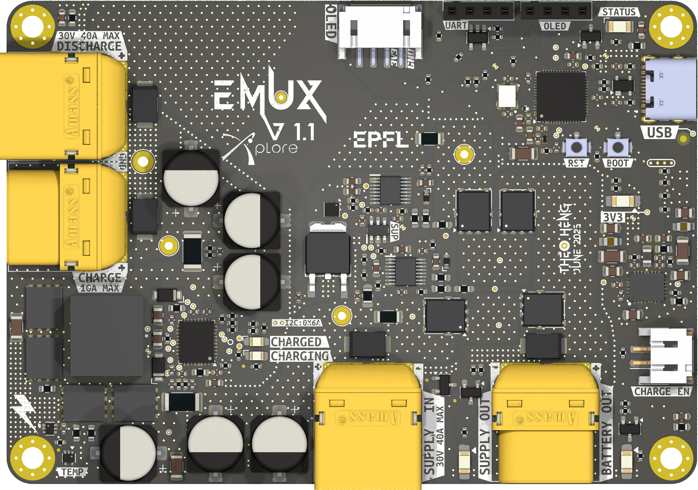
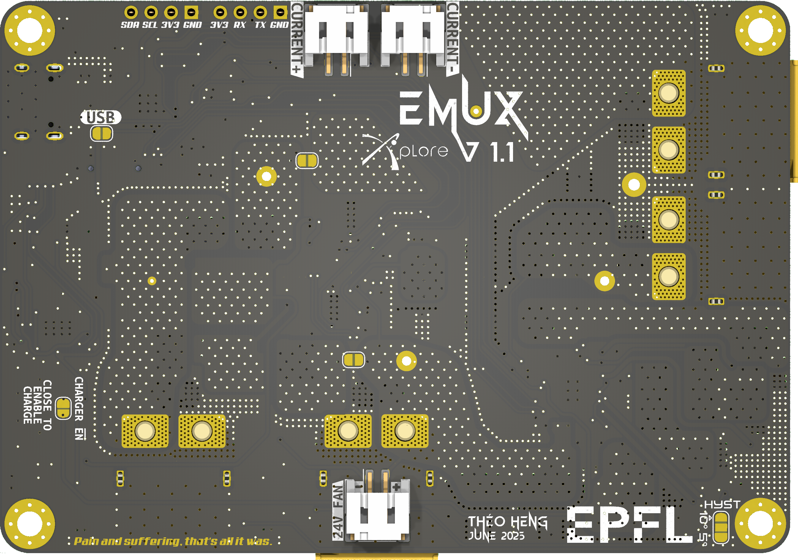

<p align="center" width="100%">
  <picture>
    <source media="(prefers-color-scheme: dark)" srcset="./Logos/EmuxLight.png">
    <source media="(prefers-color-scheme: light)" srcset="./Logos/EmuxDark.png">
    
  </picture>
</p>

<p align="center" width="100%">
    
</p>

<h1 align="center">EMux</h1>

EMux (formerly ElonMux) was designed by Théo Heng for EPFL [Xplore's](https://github.com/EPFLXplore) rover in the context of the European Rover Challenge. This board is capable to power the rover while simultaneously charging it's battery. The user have to be able to plug and unplug the power supply from the rover without shuting down/rebooting the load, requiring a power multiplexer with fast switching times and sufficient safety margins.
The system will always try to use the external power supply as the primary power source for the rover, but will default to the battery if it is not availaible.

<p align="center" width="100%">
    
</p>

***

## SPECIFICATIONS

| Parameter | EMux V1.1 | 
| --- | --- |
| Voltage Input | 10-30V |
| Continuous Supply Current | 30A |
| Continuous Discharge Current | 30A |
| Max. Continuous Charge Current | 10A |
| Mass | TBD |
| Communication | USB 2.0 / UART / I2C |
| MCU | ESP32-S3FN8 |
| Dimensions | 100x70x14mm |
| Designer   | Théo Heng        |
| Date       | Oct. 2024 - Feb. 2025 |
| Project    | ERC            |

***

## DIRECTORY STRUCTURE

```
ElonMux
├── Blender             # .pcb3d file and Blender files
├── Computations        # Computation sheets an simulation performed
├── Datasheets          # Datasheet of major components
├── Documentation       # PDF explaining design choices, component choices, user manual and much more.
├── Images              # Various images, pictures and screenshot used in the project 
    └── Photos          # High res. pictures of the assembled PCB
├── lib
    |── 3d_models       # Component 3D models
    |── lib_fp          # Footprint libraries
    └── lib_sym         # Symbol libraries
├── Logos               # Xplore and ElonMux logos
├── Manufacturing & BOMs
│   |── Assembly        # Position files, BOM, assembly document
|   |   └── ibom        # HTML BOM
|   └── Fabrication     # Fabrication document and testpoints positions
|       └── Gerbers     # Gerbers
├── Schematic           # PDF of schematic
├── STEP                # Step file of the board
├── Templates           # Title block templates
└── Thermal             # Thermal images from testing at the PEL

```

***

## FIRMWARE

The firware for EMux was written in the Arduino Framwork on Platform.io in VScode and flashed over USB. This is the recommended way of flashing the firmware. The firmware can be found on the [ERC_POWER_SW](https://github.com/EPFLXplore/ERC_POWER_SW/tree/master/ElonMux) repository.

To make the code more modular and be useful to others, I isolated the code that control the charger over I2C in a custom C++ library that automatically adapts to the target MCU, meaning it can run on ESP32, STM32, and Arduino platforms without changing a line of code. ([bq25756e_multiplatform](https://github.com/theohg/bq25756e_multiplatform))

***

## DOCUMENTATION

A complete documentation document is available in the Documentation folder. The latest version might be on the Google Drive [here](https://docs.google.com/document/d/1wnfp4IymsS4xULBs1ejpKDn9L_p6JvAJ51K0PfjIKNA/edit?tab=t.0). 

***

## CREDITS

Schematic template & project structure is hugely inspired by the work of Vincent Nguyen on its [Λ M U L E T](https://github.com/EPFLXplore/XRE_LeggedRobot_HW/tree/master/amulet_controller) controler.

***

## PHOTOS

<p align="center" width="100%">
    
</p>

<p align="center" width="100%">
    
</p>

<p align="center" width="100%">
    
</p>

<p align="center" width="100%">
    
</p>

<p align="center" width="100%">
    
</p>

<p align="center" width="100%">
    
</p>
