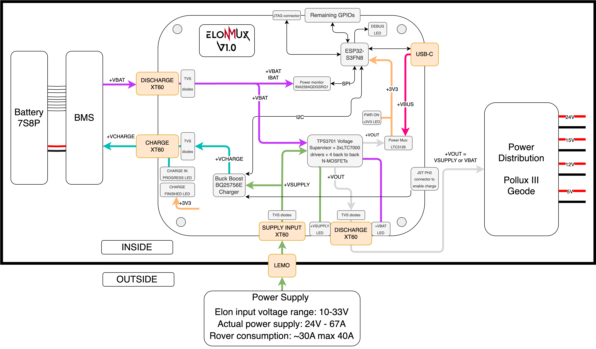
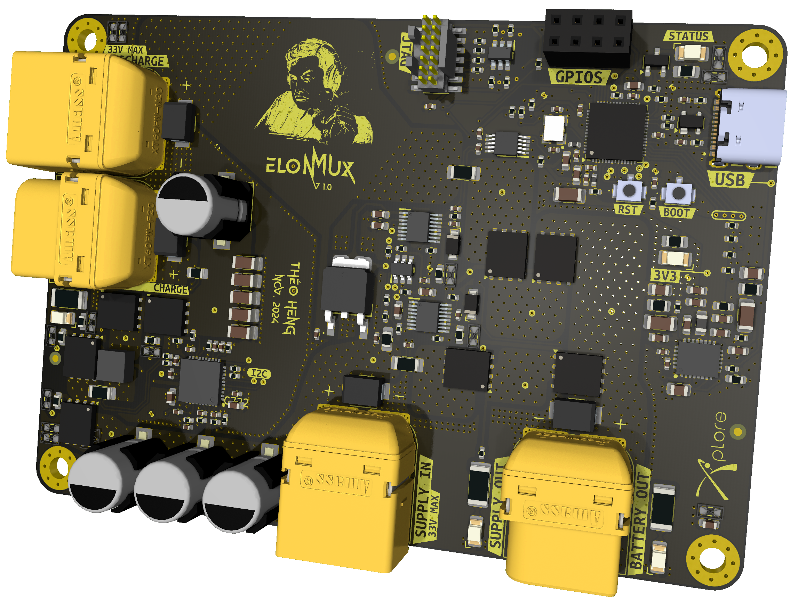
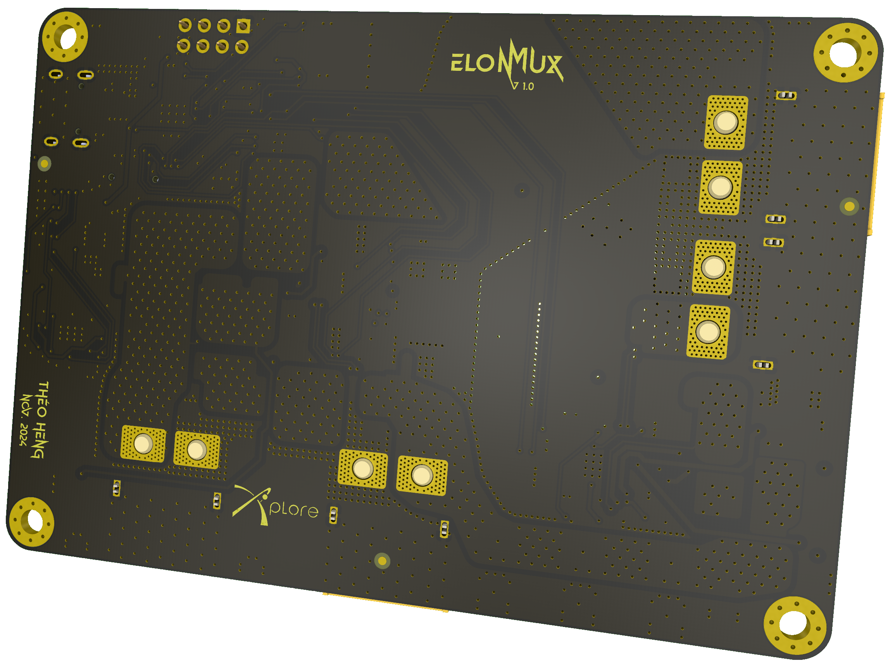

<p align="center" width="100%">
  <picture>
    <source media="(prefers-color-scheme: dark)" srcset="./Logos/ElonMuxLight.png">
    <source media="(prefers-color-scheme: light)" srcset="./Logos/ElonMuxDark.png">
    
  </picture>
</p>

<h1 align="center">ElonMux</h1>

ElonMux was designed by Théo Heng for EPFL [Xplore's](https://github.com/EPFLXplore) rover in the context of the European Rover Challenge. This board is capable to power the rover while simultaneously charging it's battery. The user have to be able to plug and unplug the power supply from the rover without shuting down/rebooting the load, requiring fast switching times. 
The system will always try to use the external power supply as the primary power source for the rover, but will default to the battery if it is not availaible.

<p align="center" width="100%">
    
</p>

***

## SPECIFICATIONS

| Parameter | ElonMux V1.0 | 
| --- | --- |
| Voltage Input | 10-33V |
| Continuous Supply Current | 30A |
| Continuous Discharge Current | 30A |
| Continuous Charge Current | 7A |
| Mass | TBD |
| Communication | USB 2.0 / JTAG |
| MCU | ESP32-S3FN8 |
| Dimensions | 100x70x13mm |
| Designer   | Théo Heng        |
| Date       | Oct. - Nov. 2024 |
| Project    | ERC            |

***

## DIRECTORY STRUCTURE

```
ElonMux
├── Computations        # Computation sheets an simulation performed
├── Datasheets          # Datasheet of major components
├── Images              # Pictures and screenshots
├── lib
    |── 3d_models       # Component 3D models
    |── lib_fp          # Footprint libraries
    └── lib_sym         # Symbol libraries
├── Logos               # Xplore and ElonMux logos
├── Manufacturing & BOMs
│   |── Assembly        # Position files, BOM, assembly document
|   |   └── ibom        # HTML BOM
|   └── Fabrication     # Fabrication document and testpoints positions
|       └── Gerbers     # Gerbers
├── Schematic           # PDF of schematic
├── STEP                # Step file of the board
└── Templates           # Title block templates

```

***

## FIRMWARE

TBI

***

## CREDITS

Schematic template & project structure is hugely inspired by the work of Vincent Nguyen on its [Λ M U L E T](https://github.com/EPFLXplore/XRE_LeggedRobot_HW/tree/master/amulet_controller) controler.

***

## PHOTOS

<p align="center" width="100%">
    
</p>

<p align="center" width="100%">
    
</p>
